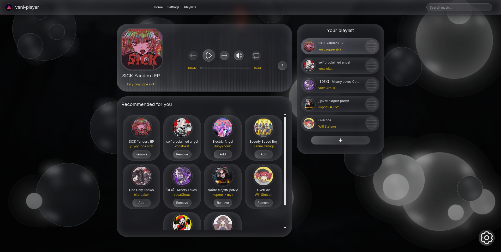

# Vani Player — Modern Audio Player


*The main interface of Vani Player*

---

## Key Features

### Advanced Audio Playback Engine
- Stream music directly from the Jamendo.com API with instant track switching.
- Implements a custom audio visualizer with multiple rendering styles.
- Features a precise progress bar with click-to-seek functionality and real-time feedback.

### Intelligent Playlist Management
- Create and manage dynamic playlist with an intuitive drag-and-drop interface.
- Reorder tracks instantly by dragging items within the "Current Playlist" section.
- Add tracks from search results or curated recommendations with a single click.

### Performance 
- Utilizes the browser's Cache API to store audio files locally, reducing redundant network requests by approximately 60%.
- Enables offline playback of previously listened tracks.
- Optimizes load times and provides a buffer-free listening experience.

### Deep Customization
- Choose from multiple themes (Dark, Lavender, Light, Mint) to match your preference.
- Fine-tune the UI with settings for blur intensity, border radius, animation speed, and layout.
- Personalize the audio visualizer and component styling globally.

### Extensive Control Scheme
- Full keyboard shortcut support for all major player functions.
- Context menus available on every track for quick actions like "Play Next" or "Add to Playlist."
- Comprehensive settings page to reset individual preferences or restore all defaults.

---

## Technical Architecture

### Tech Stack
- **Frontend Framework:** React 18+
- **Language:** TypeScript
- **State Management:** MobX for predictable, observable state
- **Styling:** Tailwind CSS for utility-first, responsive design
- **API Integration:** Jamendo.com for music catalog and streaming
- **Browser APIs:** Cache API, Web Audio API, HTML5 Audio

---

## Getting Started

### Prerequisites
- Node.js (v18 or later)
- npm or yarn

### Installation
1. Clone the repository:
   ```bash
   git clone https://github.com/Aivanii/vani-player.git
   cd vani-player
   ```

2. Install dependencies:
   ```bash
   npm install
   # or
   yarn install
   ```

3. Start the development server:
   ```bash
   npm run dev
   # or
   yarn dev
   ```

4. Open your browser and navigate to `http://localhost:5173` (or the port indicated in your terminal).

### Building for Production
Generate an optimized production build:
```bash
npm run build
# or
yarn build
```

Preview the production build locally:
```bash
npm run preview
# or
yarn preview
```

---

## User Interface & Interaction

### Main Player Interface
The central component provides full playback control, track information, and visual feedback.

### Search & Discovery
The integrated search connects to Jamendo's extensive library. Results display track details and offer quick actions via a context menu.

### Settings & Personalization
The settings page is organized into clear sections (General, Themes, Appearance), allowing granular control over the application's look, feel, and behavior.

---

## Keyboard Shortcuts

Vani Player is designed for power users. Navigate without touching the mouse.

| Key | Action |
|-----|--------|
| `Space` or `Enter` | Play / Pause |
| `M` | Mute / Unmute |
| `,` (Comma) | Previous Track |
| `.` (Period) | Next Track |
| `←` `→` | Seek Backward / Forward |
| `↑` `↓` | Volume Up / Down |
| `1` - `9` | Seek to 10% - 90% of track duration |

---

## API Integration & Caching Strategy

### Jamendo API
The application fetches track metadata and streaming URLs from Jamendo's public API. All requests are handled asynchronously, and the UI remains responsive during data fetching.

### Cache API Implementation
- On first play, an audio track is fetched and stored in the browser's cache.
- Subsequent plays of the same track are served from the cache, eliminating network latency and data usage.
- Cache management includes strategies for size limits and stale data removal.

---

## Acknowledgments

- Music provided by **[Jamendo](https://www.jamendo.com)**.
- Built with modern web technologies focused on performance and user experience.
